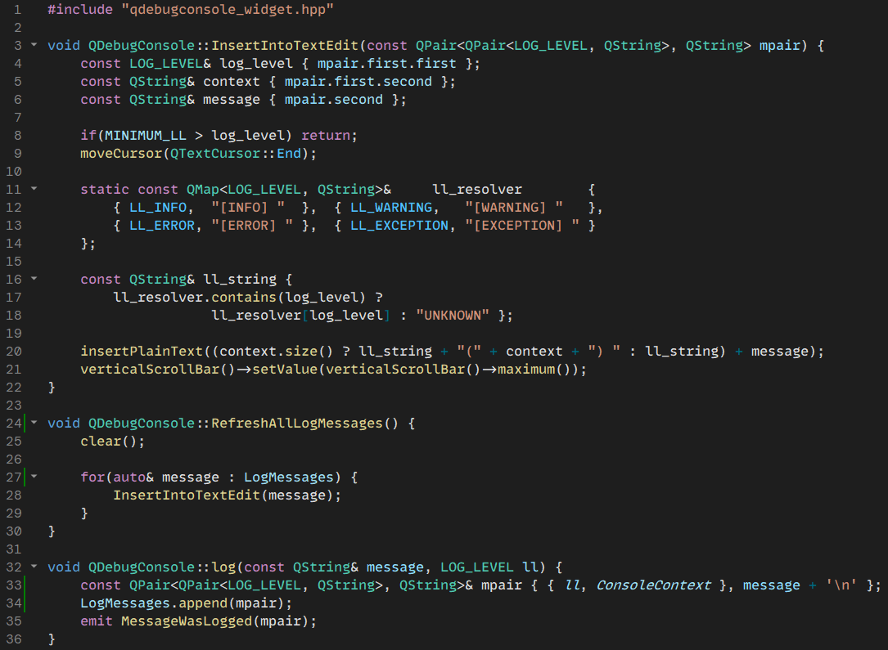
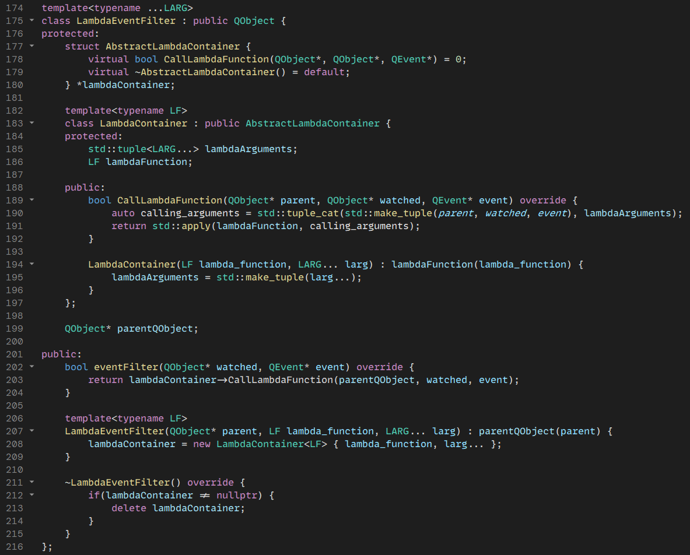
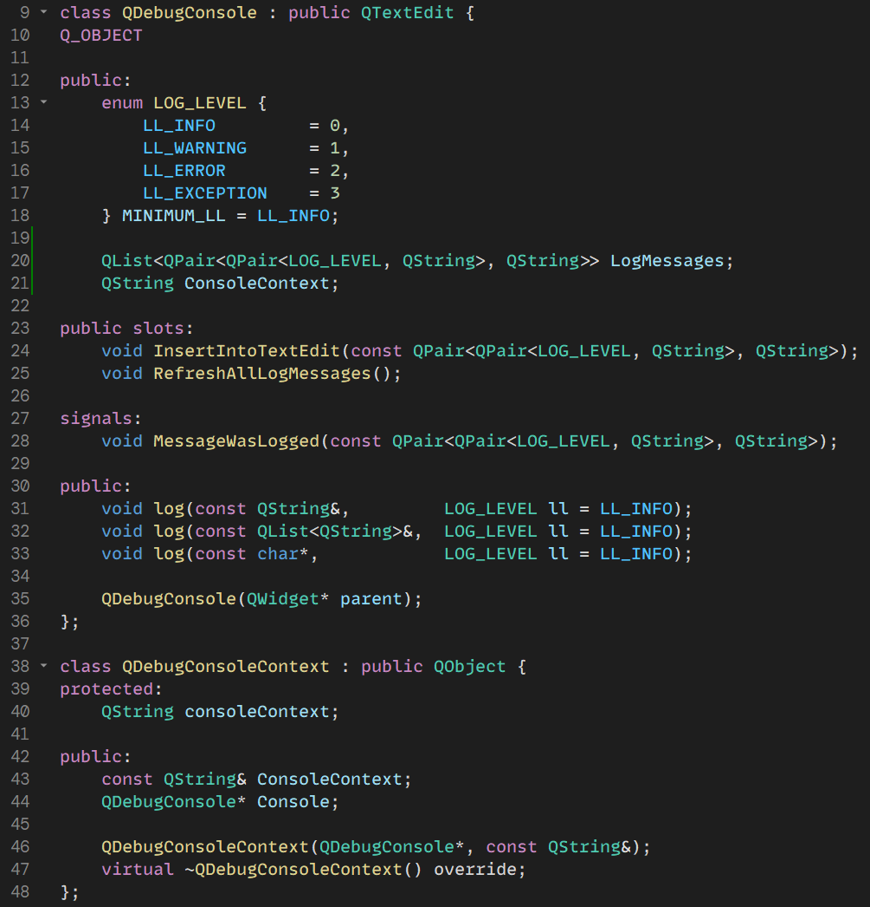
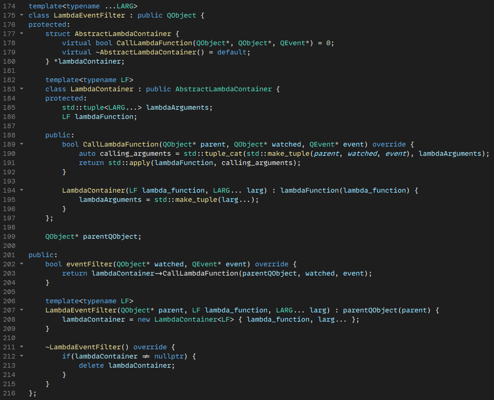
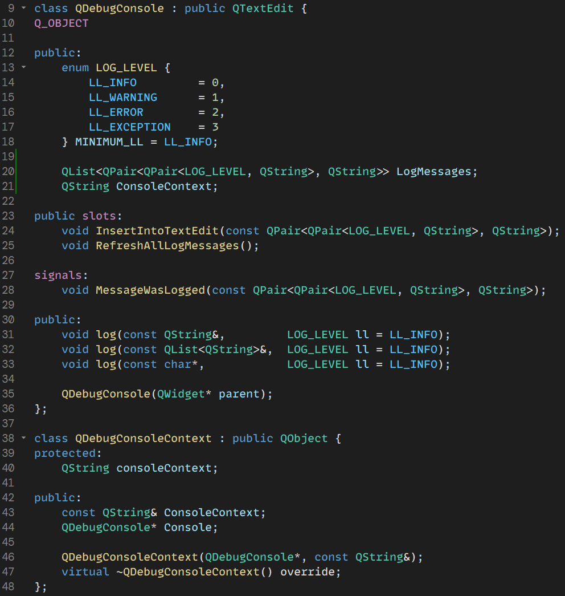
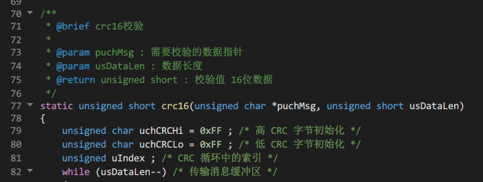

# VSCode Dark+ Theme For Qt Creator

I tried my best to port the default Dark+ theme from VS Code into Qt Creator, as I find it quite nice, but I cannot replicate it 1:1 due to the limitations of Qt's theme engine, for example Qt doesn't differentiate between keywords like `const`, `namespace`, and `enum` which would be blue in VSCode, and keywords like `if`, `operator`, `return`, which would be purple in VSCode; it's either one or the other in Qt, so I've included both options to choose from, purple keywords (what I prefer), but also blue keywords. I hope you enjoy!

## Installation

For the editor theme, [pick your xml](../../releases) and move it into your Qt Creator **styles** directory. To theme the IDE itself, move the `.creatortheme` file into your Qt Creator **themes** directory. Editor styles and IDE themes are inependent, but why not get both? 

Those directories exist next to each other, and are located in one of two places: your Qt installation directory, or your Qt user directory. The user directory is where I'd suggest you place them, since any styles or themes placed in the installation directory cannot be modified from within Qt, as that's where the defaults are located and isn't really meant for custom styles/themes, but maybe you actually prefer that.

The location of the Qt user directory varies depending on your operating system.

_From: https://doc.qt.io/qtcreator/creator-quick-tour.html#location-of-settings-files_

### Windows Location
- Full Paths: 
  * `C:\Users\%USERNAME%\AppData\Roaming\QtProject\qtcreator\styles`
  * `C:\Users\%USERNAME%\AppData\Roaming\QtProject\qtcreator\themes`

- Shortcut Paths:   
  * `%appdata%\QtProject\qtcreator\styles`
  * `%appdata%\QtProject\qtcreator\themes`

If the `theme` or `styles` folder don't exist, create them.

### Linux Location
- `~/.local/share/data/QtProject/qtcreator`

### OSX Location
- `~/Library/Application Support/QtProject/Qt`

## Previews
Font used in the screenshots:  [MonoLisa](https://www.monolisa.dev/)

### Purple Keywords Preview 

### Blue Keywords Preview

### Doxygen Comments

## Additional Credits
* `.creatortheme` and Doxygen comment colours courtesy of [yunke120](https://github.com/yunke120)
