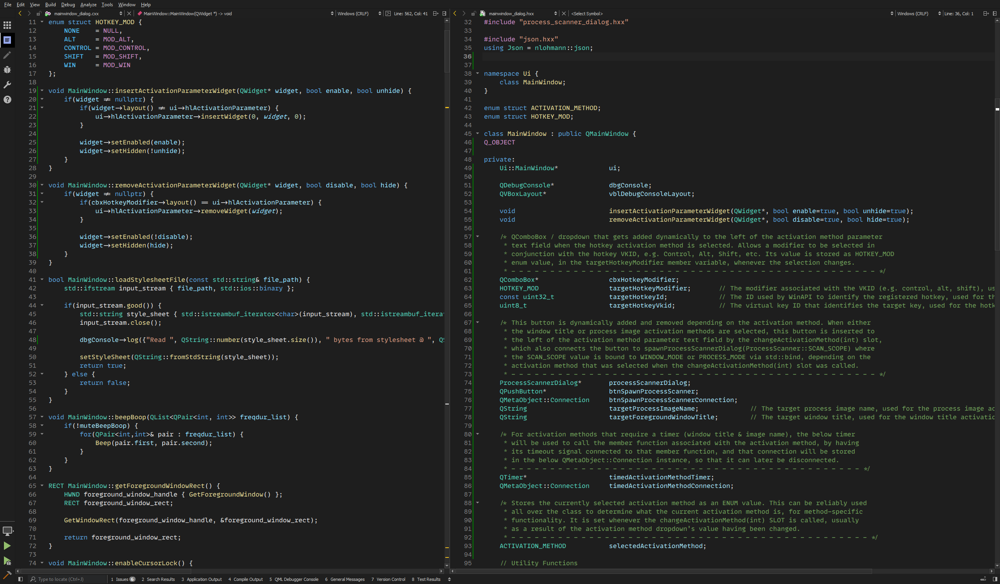
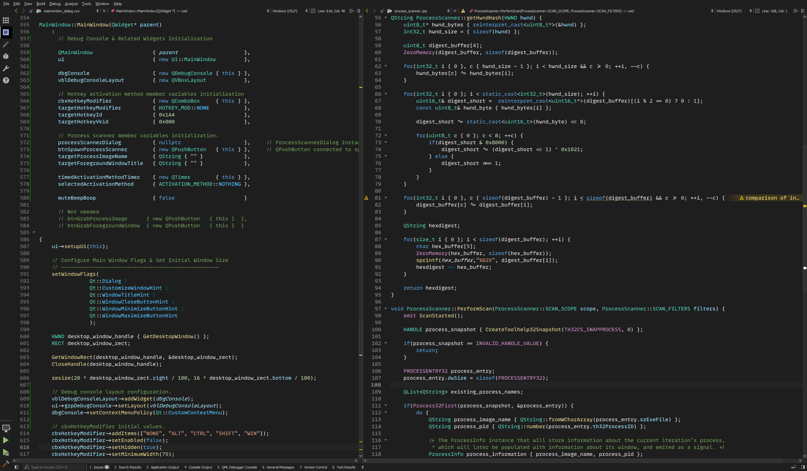

# VSCode Dark+ Theme For Qt Creator

I tried my best to port the default Dark+ theme from VS Code into Qt Creator, as I find it quite nice, but I cannot replicate it 1:1 due to the limitations of Qt's theme engine, for example Qt doesn't differentiate between keywords like `const`, `namespace`, and `enum` which would be blue in VSCode, and keywords like `if`, `operator`, `return`, which would be purple in VSCode; it's either one or the other in Qt, so I've included both options to choose from, purple keywords (what I prefer), but also blue keywords. I hope you enjoy!

## Installation
Just move one or both of the `.xml` files of your choice into your Qt Creator styles folder. The location of this folder depends on your operating system, but there are typically two: one that's part of the Qt installation folder, which contains Qt's default themes, and themes placed there cannot be modified, and then there's the recommended folder which is usually located somewhere in your user directory.

_From: https://doc.qt.io/qtcreator/creator-quick-tour.html#location-of-settings-files_

### Windows Location
- Full Path: `C:\Users\%USERNAME%\AppData\Roaming\QtProject\qtcreator\styles`
- Shortcut: `%appdata%\QtProject\qtcreator\styles`

### Linux Location
- `~/.local/share/data/QtProject/qtcreator`

### OSX Location
- `~/Library/Application Support/QtProject/Qt`

## Purple Keywords Preview 

## Blue Keywords Preview

